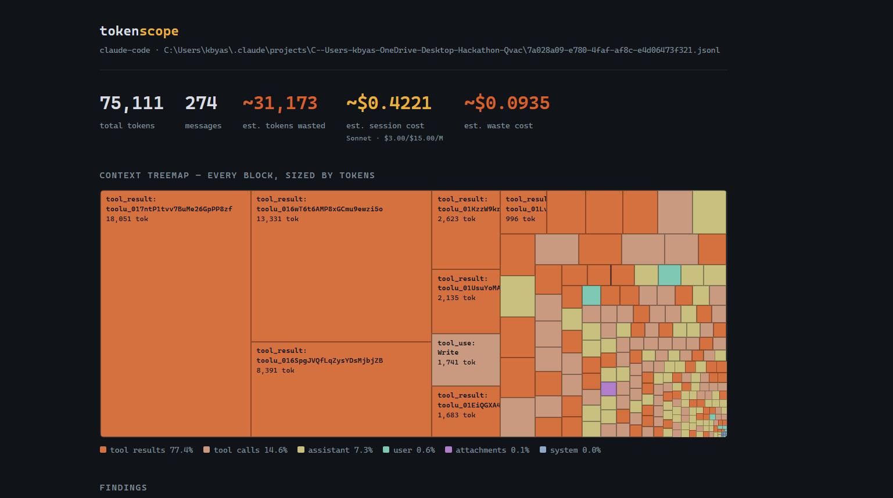
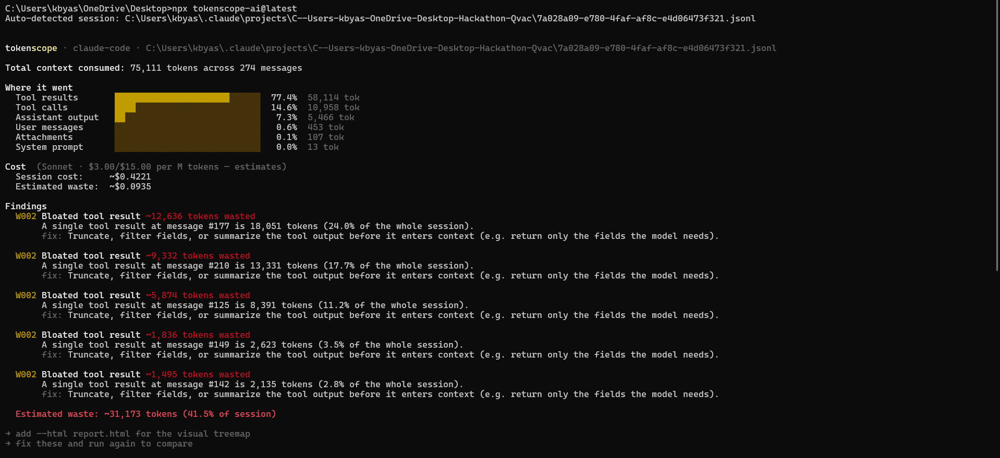

[](https://www.npmjs.com/package/tokenscope-ai)

# tokenscope

**Chrome DevTools for your context window.** See exactly where your AI tokens go — and stop wasting them.



<!-- TODO: demo GIF goes here. This is the single most important asset in the repo. -->

Your agent session just burned 500K tokens. Where did they go? tokenscope profiles your session logs and tells you: which files got re-sent six times, which tool result dumped 20K tokens of JSON the model never used, and what it's costing you.

```
npx tokenscope-ai ~/.claude/projects/my-project
```



## Why

- **100% local.** No API key, no account, no telemetry. Your logs never leave your machine.
- **Actionable.** Every finding comes with a concrete fix and an estimated saving — like a linter, not a dashboard.
- **Fast.** Profiles a session in under a second.

## Install

```bash
npx tokenscope-ai <session.jsonl>        # zero-install
npm install -g tokenscope-ai            # or install globally
```

## Usage

```bash
tokenscope-ai ~/.claude/projects/my-project        # newest session in a directory
tokenscope-ai session.jsonl                        # a specific session file
tokenscope-ai session.jsonl --html report.html    # + shareable HTML treemap report
```

The HTML report is a single self-contained file — open it in any browser, share it with your team, attach it to a PR.

## Supported sources

| Source | Status |
|---|---|
| Claude Code session logs (`~/.claude/projects/`) | ✅ v0.1 |
| Universal proxy mode (any tool, any provider) | 🔜 v0.2 |
| OpenAI / raw API JSONL dumps | 🔜 v0.3 |
| Gemini CLI, aider, community adapters | 🔜 [adapter spec](#) |

Token counts use a local tokenizer (o200k) and are estimates (~±5%) — profiling is about proportions and deltas, not billing precision.

## Findings rules

| Code | Detects |
|---|---|
| W001 | Repeated content — the same chunks sent multiple times |
| W002 | Bloated tool results — oversized outputs dominating the context |
| W003 | Cache opportunity — low/no prompt cache hit rate (or, without usage data, heavy repeated content) that caching would fix |

More rules (cache-miss analysis, conversation decay, dead-weight system prompt sections) are on the roadmap. Have an idea for a rule? Open an issue.

## Contributing

Adapters are ~100 lines: parse your tool's log format into the unified session model (`src/parser/claudeCode.js` is the reference). PRs welcome.

## License

MIT
